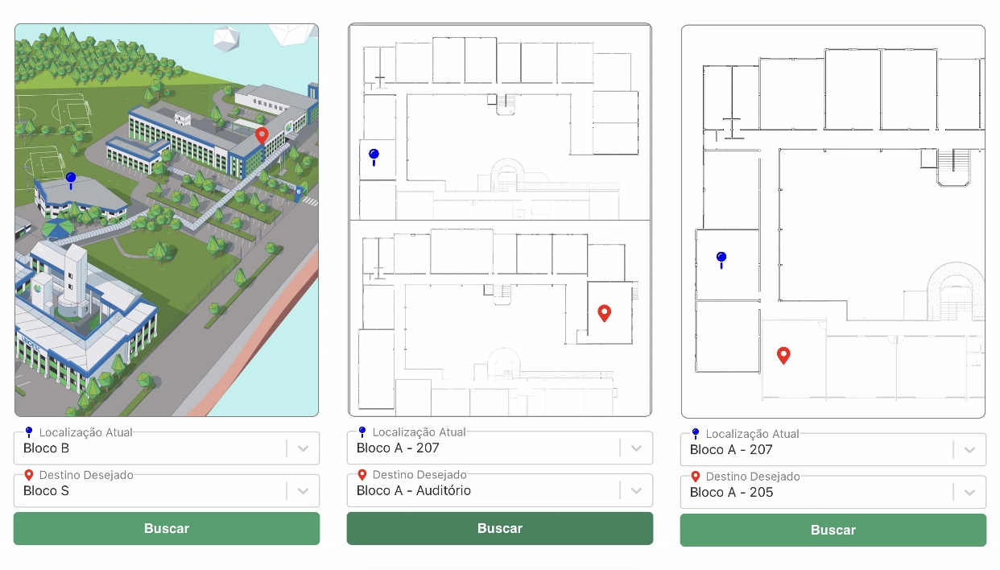
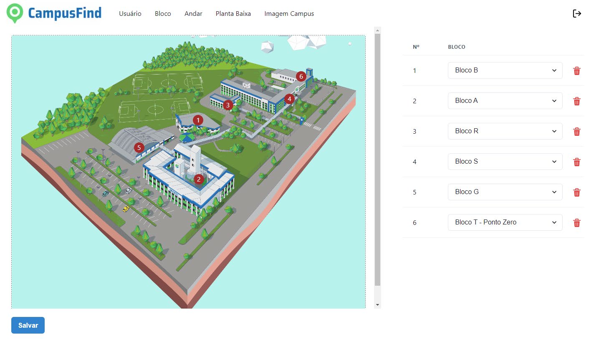

# CampusFind

CampusFind é um sistema para localização de ambientes no campus da UNOESC em Chapecó.

## 🖼️ Visão Geral

### 🔍 Busca de Salas


### ⚙️ Tela de Administração de Blocos


## 📘 Documentação

- 📄 [Guia de Utilização da Aplicação (PDF)](docs/how-to.pdf)

## Pré-requisitos

- Docker instalado

## Instruções para iniciar a aplicação

1. Clone o repositório e acesse o diretório do projeto.

```bash
git clone https://github.com/GuiBrust/localizacao-interna.git
cd CampusFind
```

2. Acesse a pasta do backend e frontend, e faça o build das imagens Docker:

```bash
cd backend
docker build -t backend .
```
```bash
cd ../frontend
docker build -t frontend .
```

3. Volte para o diretório raiz e execute o `docker-compose` para iniciar a aplicação:

```bash
cd ..
docker compose up
```

Agora, a aplicação estará rodando e pronta para uso.
